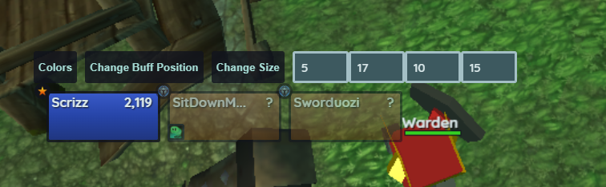
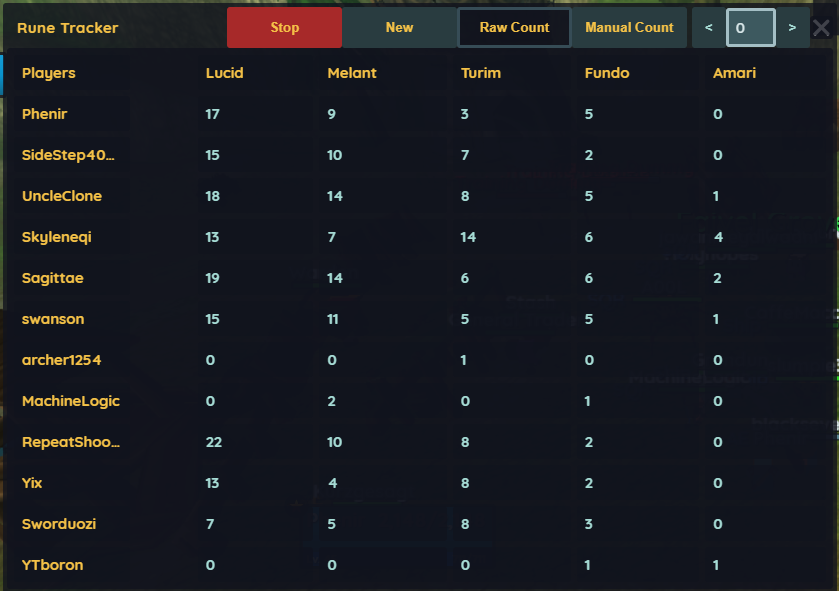

# Hordes UI Framework

## Overview

The Hordes UI Framework is designed to facilitate the development and management of mods for the unpopular online multiplayer game, Hordes.io. This framework provides a set of tools, libraries, and guidelines to streamline the process of creating and integrating mods, enhancing the gaming experience for players.

## Examples

